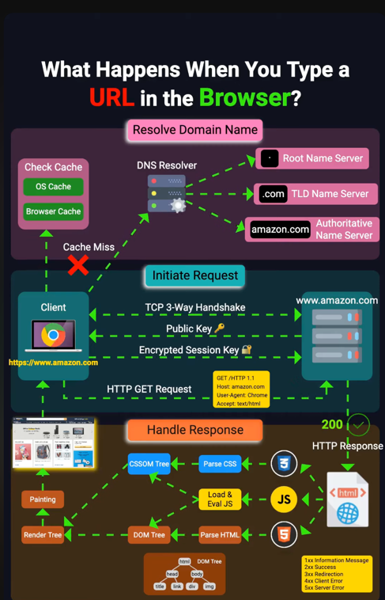

✅ 1. What Happens When You Type a URL in the Browser
This is a common interview question and touches many networking layers:

Steps:

* DNS Lookup – Browser resolves www.example.com into an IP address via DNS.

* TCP Connection – Establishes a TCP connection with the server (3-way handshake).

* HTTPS/TLS Handshake – If using HTTPS, browser and server establish encryption.
  * Client connects to server
  * Server sends its public key
  * client generates session key, encrypts the session key using public key
  * sends encrypted key to server
  * all further communication happens using this session key

* HTTP Request Sent –
  * Browser sends a GET request to fetch the page.
  * CORS Check happens here

* Server Processes & Responds – Server sends back HTML, CSS, JS.

* Rendering – Browser renders the page, may make more requests (images, APIs).

* Caching & Cookies – Browser may cache content and send cookies along.

